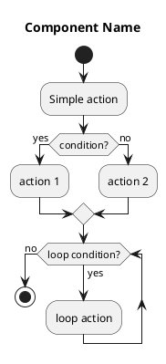
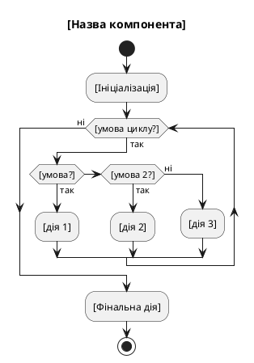

# CLAUDE.md

This file provides guidance to Claude Code (claude.ai/code) when working with code in this repository.

## Build Commands

```bash
# Compile the project (full translator)
g++ -o lab_4_5 main.cpp lexer.cpp parser.cpp semantic.cpp codegen.cpp

# Run the analyzer on default file (program.z07)
./lab_4_5

# Run on specific .z07 file
./lab_4_5 test1_linear.z07

# Run generated executable
./output
```

The program reads source code from `.z07` files (Z07 language) and performs:
1. Lexical analysis
2. Syntax analysis
3. Semantic analysis
4. Code generation (C code)
5. Compilation to executable

**File extension:** `.z07` (Z = Запливаний, 07 = variant number)

---

## PlantUML Diagrams

The `diagrams/` folder contains UML activity diagrams for all translator components.

### How to Create Similar Diagrams for Other Variants

**Important**: Use **simplified** PlantUML syntax for online compatibility!

#### ✅ Good Practices (онлайн-сумісні):



#### ❌ Avoid (складні конструкції):

- ❌ Nested `partition` blocks (викликають помилки онлайн)
- ❌ Swimlanes `|name|` (потрібно на початку діаграми)
- ❌ Складні вкладені умови (більше 2 рівнів)
- ❌ Довгі тексти в одному блоці (розбивай на кілька рядків)

#### 📋 Template для нових діаграм:



#### 🎨 Styling (optional):

```plantuml
skinparam backgroundColor #FFFFFF
skinparam activityBorderColor #000000
skinparam activityBackgroundColor #E8E8E8
skinparam defaultTextAlignment center
```

#### 🧪 Testing:

Before creating multiple diagrams, test on http://www.plantuml.com/plantuml/uml/

#### 📦 Files Structure:

```
diagrams/
├── 01_main.puml          # Main translator flow
├── 02_lexer.puml         # Lexical analysis
├── 03_parser.puml        # Syntax analysis
├── 04_codegen.puml       # Code generation
├── 05_semantic.puml      # Semantic analysis
├── ГОТОВИЙ_КОД.txt       # All diagrams for copy-paste
└── README.md             # Documentation
```

#### 💡 Tips:

1. **Keep it simple** - спрощені діаграми легше читати та генерувати
2. **Test online first** - перевіряй на http://www.plantuml.com/plantuml/
3. **Use Ukrainian** - PlantUML підтримує UTF-8
4. **One file per component** - окрема діаграма для кожного модуля
5. **Create ГОТОВИЙ_КОД.txt** - зручно для копіювання всіх діаграм

---

## Architecture

This is a lexer and parser for a custom programming language (курсовий проєкт for System Programming course, variant: Запливаний Данііл Валерійович).

### Components

- **token.h** - Token types enum (`TokenType`) and `Token` struct with type, value, and line number. Contains `tokenTypeToString()` helper.
- **lexer.h/cpp** - `Lexer` class performs lexical analysis: tokenizes source code, handles comments (`%% ... %%`), validates identifiers (must start with uppercase, max 4 chars) and numbers (int16_t range: 0-32767).
- **parser.h/cpp** - `Parser` class implements recursive descent parser for syntax analysis.
- **main.cpp** - Entry point, reads `program.txt`, runs lexer, visualizes tokens per line, then runs parser.

### Language Syntax (Variant Specific)

```
program <ID>;
var int16_t <ID>, <ID>, ...
start
    <statements>
finish
```

**Statements:** assignment (`ID <- expr`), input (`get ID`), output (`put expr`), if/else (Swift style), for-in loop (Swift style)

**Operators:**
- Assignment: `<-`
- Arithmetic: `+`, `-`, `*`, `/`, `%`
- Comparison: `eg` (equal), `ne` (not equal), `>=`, `<=`
- Logical: `!`, `and`, `or`
- Range: `..` (for loops)

**Keywords:** `program`, `var`, `start`, `finish`, `get`, `put`, `if`, `else`, `for`, `in`, `int16_t` (all lowercase)

### Lexer Rules

- **Identifiers:** ALL UPPERCASE letters (Up4 rule), max 4 characters
  - ✅ Valid: `A`, `SUM`, `MAX`, `TEMP`
  - ❌ Invalid: `Sum`, `max`, `Variable` (>4 chars)
- **Numbers:** int16_t range (0-32767)
- **Comments:** `%% ... %%` (can be multiline)

### Control Flow Syntax

```
if <expr> start <statements> finish
if <expr> start <statements> finish else start <statements> finish

for <ID> in <expr> .. <expr> start <statements> finish
```
